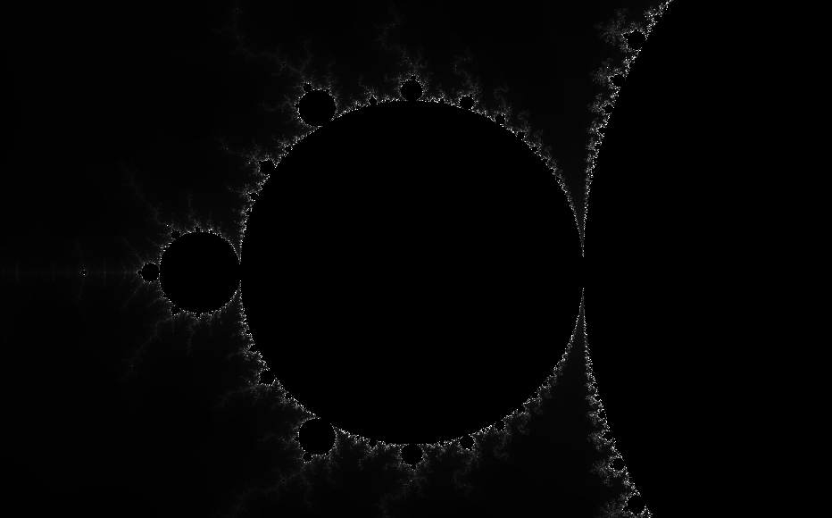

# Fractal Generator / Renderer
> A CPU based fractal renderer implemented in Python

## Requirements
* Python
  * go to `www.python.org/downloads` to get the latest version.
    
* Pygame
  * run `pip install pygame` in your Command Prompt to install pygame.

## Currently Supported Fractals
* Julia Sets
* Defaults to Mandelbrot set

